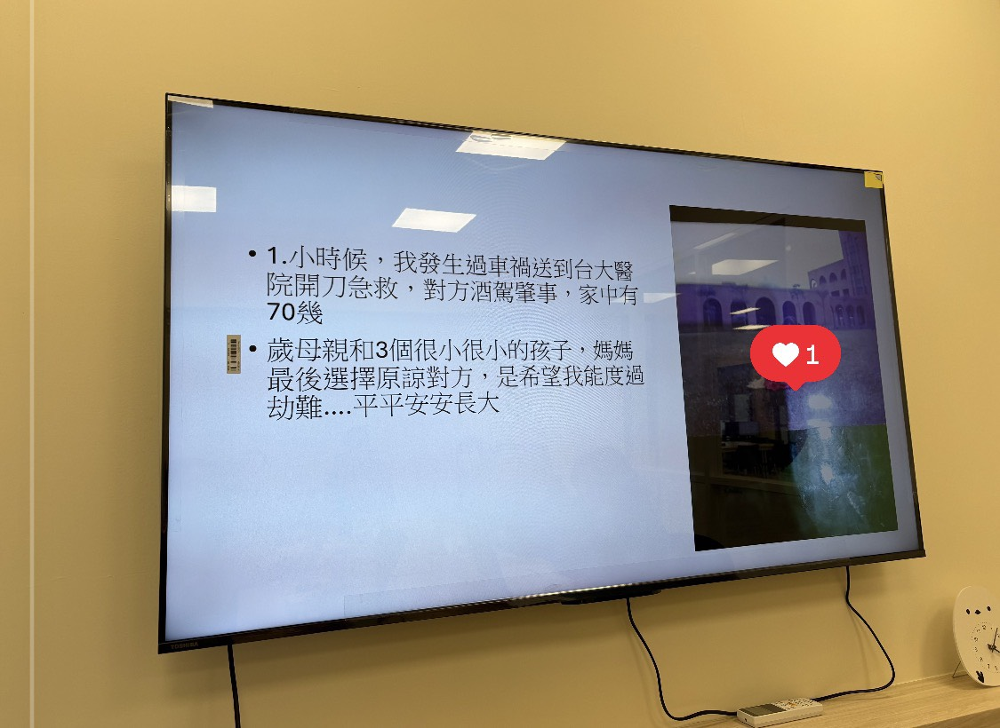

接續上次生命敘事的整理，後來會員們順利在心衛中心分享。小插曲是在結尾的時候，強迫症的那位會員O衝出來，用很強硬的方式一定要講，儘管事情她沒有報名，也說好沒有人會聽她說，她依然重複唸了兩三次。

---
### ㄧ、重複的問句與行為
⁡
會員O一開始來到會所時，動力明顯都是為了會所補助的餐費和出遊，後來才慢慢開始想學習電腦。
⁡
每次來會所的時候，總是會有重複檢查的行為，或是手部會有怪動作，有時嚴重到她自己會卡住，需要被人打斷。例如：不斷重複的問句、離開會所時重複檢查三四次、卡在廁所裡重複洗手檢查四五次以上。
⁡
面對這種重複問句的行為實在很惱人，且讓人失去耐性，因此會員O也是經常被我們唸的會員之一。
⁡
自從上次心衛中心結尾爆衝之後，其實會員O有準備她自己手寫的生命敘事，只是她的口語能力蠻弱的，很難講出不重複的完整段落。

---
### 二、生命敘事與精神疾病
⁡
上週四，我們為了下週的宣導再次進行敘事的團體，一邊聆聽會員O的故事，一邊又更了解了。
⁡
排行第一的她提到，自從小時候父母就經常吵架、鬧離婚，而且會說要把她和妹妹一起送去孤兒院。到了高中的時候，或許是因為壓力，她開始出現怪動作和重複檢查的行為，因此診斷精神疾病。
⁡
//
三、強迫症背後的意義
⁡
我帶著好奇的耳朵在想，強迫症的意義是什麼，會員O提到就是會檢查東西、因為不確定感就要一直檢查、確認。
⁡
我連接到她小時候父母爭吵的經驗，推測她是否是因為敏感到即將分崩離析的家，而出現強迫症的行為，強迫症的背後是為了獲取更多的安全感、確定感。
⁡
很有意象性的是，會員O手部有時會有怪動作，要抓握住什麼，這背後的意義會不會是抓住不穩的家庭關係呢？
⁡
從這個角度來說，我覺得更了解強迫症的背後的意義，重複的問句與檢查行為都是為了獲得更多「確定感、安全感」，就像是抓握住浮木一般，因此力量是蠻用力直接的。
⁡
儘管平常真的很受不了會員O的重複，但會覺得那就是她的樣子，而這次又更貼近了一點，很感謝她願意開放與分享。

---
### 四、一顆單純的心
⁡
這次的敘事整理感受到會員O強烈的慾望要分享自己的生命故事，在她的簡報中提到，分享的目的是想要趕快把病治好，看有沒有貴人或醫生可以治好強迫症，還附上自己的手機號碼。
⁡
雖然當下聽到有點喜感，但我覺得是很真摯、單純、懇切的慾望。回想起來，上次在大型研討會上，她也是勇於舉手發問，精神疾病怎麼樣才會好。

---
### 五、賦予病痛意義
⁡
強迫症的重複、固執、程序化，看起來很難被打斷，可是我心裡很清楚的是，很多是當事人沒辦法控制的。
⁡
第一次認識強迫症是在實習的時候，那位會員分享強迫症停不下來的感覺非常痛苦，出門總是有困難、洗澡要好幾個小時，進而引發他很想結束生命的念頭。
⁡
這次聽到會員O的故事，自然就連接到她的強迫症會不會是因為爭吵的父母、擔心要被送到孤兒院的壓力而產生的？
⁡
儘管我們都無法確定真正的答案，但我覺得這樣的連結是回應她的病痛經驗，將原本被病理化的症狀，還原為她的生命敘事，試著從另一種的角度去看待強迫症，並賦予意義。
⁡
被貼上強迫症標籤的人特別辛苦，重複的行為與強迫的意念，經常把人簡化為一個扁平的人。
⁡
聆聽病痛的意義就在於，想要從不同角度詮釋生命敘事，會所有條件創造如此的氛圍，而這本身就在對抗精神醫療的病理化觀點。

---
### 六、補充：運用創意的方法打破行為模式
⁡
每次碰到會員O又在重複問句的時候，我會先選擇性回答，如果回答過了可能就更用力一點強調回答過，或是用問句去回應她的問句。
⁡
上週四，她又開始重複問句問我，我靈機一動用英文回答她，她一時語塞，因為這打破了她習慣的言語對話模式。發揮這種創意，帶著實驗精神用不同方式回應她的重複，真的好有趣！