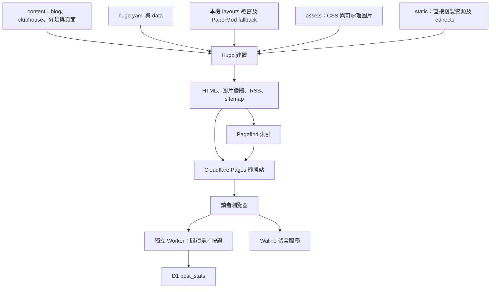

# 聆聽的河流：架構複核與新一輪評估計畫

日期：2026-09-28。基準分支：`codex/0928-2`；提交：`ccf28362df83da6bea097dd35f9f106c1ad6d2ab`。

## 下次接續

首頁視覺與 single 延伸設計請先讀 [2026-10-09 首頁風格與色票筆記](design/home-design-system-2026-10-09.md)。其中區分已實作首頁規格與尚未實作的文章頁建議；Header 保留宋體等大小字標與細河線，桌機下層選單已改為置中。

這是下次進入專案時的交接提醒，不是排程通知；本輪只交付計畫，評估與修復待下次接續。

1. 執行 `git status -sb` 與 `git log -3 --oneline`，確認目前分支、最新提交與使用者變更；不要假設仍在本文件的基準 commit。
2. 先查 `codebase-memory-mcp` 的 `index_status`，確認根目錄與目前分支；索引過期才更新。既有 project id 為 `C-Users-wenyang-Documents-GitHub-listenriver.com`，若環境改變需重新確認。
3. 為節省 token，先用精簡架構摘要或限定範圍的 `search_graph`／`trace_path` 找關係，再讀必要原始碼；不要重新傾印所有模板與歷史報告。Hugo 模板有解析缺口，關鍵結論仍須來源查證。
4. 優先開始本計畫 A、B：建立版本一致的乾淨建置基準、執行既有網址與改名檢查、重掃站內連結；另整理中文搜尋案例，供 C 階段重現。
5. 交付四份可追溯證據：建置／測試基準、新失效連結清單、改名正式 HTTP 驗證表、搜尋案例表。正式站未檢查的項目標示待驗證，不以本機產物推論已部署。
6. 不重做閱讀筆記改名、不重跑歷史分類遷移；保留文章 URL、五類與首頁六卡。取得新證據後再分批修復。

## 核心判斷

保留 Hugo、PaperMod、Pagefind 與現有五類＋會所專區。下一輪的重點是讓既有改動可以可靠驗證，修復找文與續讀的斷點，再逐步降低模板與樣式的維護成本。沒有足夠證據支持整站重寫、全面重分文章或替換搜尋引擎。

9/12 報告的方向仍有價值，但它已不是現況待辦清單：閱讀筆記改名、分類總覽說明、會所系列目的地、搜尋系列入口與 CI 網址守門都已有後續實作。新的排序應是「可重現基準 → 閱讀路徑與搜尋 → 互動正確性及鍵盤操作 → 小批架構整理 → 依量測優化效能」。

## 證據範圍

- 已閱讀使用者提供的桌面版 9/12 報告，並對照專案內 9/25～9/27 的盤點、交接與實作紀錄。文件中的指令只當歷史背景，沒有執行遷移、部署或內容重分。
- 先查 codebase-memory-mcp：根目錄、分支與 HEAD 對應目前專案；coverage 顯示 metadata_changed 後重新執行 full 索引。圖有 5,362 節點、5,891 關係，48 檔部分解析、4 檔解析不可用。
- 圖用於定位模組及互動呼叫，再直接讀原始碼確認。Hugo partial 動態引用未完整反映在圖中；自動辨識的 route/layer 也含非站內路由，不能用圖的「1 route」解讀網站路由數。
- 本輪已完成乾淨 Hugo 建置及 Pagefind 索引；未做全站連結重掃、瀏覽器視覺／鍵盤驗收、正式站 HTTP 遷移檢查、D1 實測、Search Console／GA4／CrUX 分析。
- 下文的「已確認」指目前來源或本輪建置；「歷史」指先前文件紀錄；「待驗證」不是已確認缺陷。沒有將舊報告的 276 個候選連結直接沿用為現在的數量。

## 一、目前架構

部署關係依專案設定與文件確認，尚未登入 Cloudflare 或 Vercel 核對正式環境。

| 層次 | 實際入口與責任 | 變更影響 |
| --- | --- | --- |
| 內容 | `content/blog/`、`content/clubhouse/` 的文章與 page bundle；categories/tags 為閱讀入口 | front matter 影響分類、推薦、SEO；路徑變更還會影響歷史互動識別 |
| 模板骨架 | `layouts/_default/baseof.html` → head、header、main block、PaperMod footer | 全站影響；Pagefind body scope 也在這裡 |
| 首頁 | `layouts/index.html` 組合 hero、精選、主題、會所、最新文章、作者與圖集 | 保留六張入口的既有版型；精選仍在建置時 shuffle |
| 主題導覽 | `taxonomy-content.html` 承擔分類／標籤多種頁型；`site-nav-items.html` 管主選單 | 資料選取與大量內嵌 CSS 混合，修改容易跨頁型擴散 |
| 文章 | `single.html` 組合 cover、TOC、content_cleanup、互動 v2、留言、內文連結、推薦與前後篇 | 應以長標題、直式封面、長文、圖文與會所系列作樣本 |
| 共用資料 | `article-pages.html` 取 blog＋clubhouse；`taxonomy-landing.yaml`、`featured-tags.yaml`、hugo params 與 nav partial 分別提供入口資料 | 已有局部共用，但未形成完整單一來源；不同入口的排序不必強制相同 |
| 樣式 | `head.html` 合併 PaperMod core 與所有 `css/extended/*.css` | 實際是全站 bundle；不能只看 hugo.yaml 的 customCSS 宣告判斷載入範圍 |
| 主 JS | `extend_head.html` 讀 `static/js/custom.js`，經 FromString、壓縮、指紋後載入 | `assets/js/custom.js` 仍存在，但不是此主入口；另有模板內 inline JS |
| 搜尋 | `search.html` 使用 Pagefind UI、查詢網址同步、完整系列入口；建置後產生索引 | 系列入口與全文命中是兩套機制，必須各自驗收 |
| API／留言 | custom.js → Worker `/stats`、`/view`、`/like` → D1；comments partial 另載入 Waline | 兩個不同服務、不同資料與部署生命週期，不能混為一套留言系統 |
| CI | Hugo workflow 驗證 build、URL guard、改名產物、搜尋及 Worker check；另有 Playwright workflow | 已有基礎防線；還缺連結品質、完整鍵盤行為與 Worker 計數行為測試 |

關鍵來源：[骨架](../layouts/_default/baseof.html)、[首頁](../layouts/index.html)、[文章](../layouts/_default/single.html)、[CSS 組合](../layouts/partials/head.html)、[JS 入口](../layouts/partials/extend_head.html)、[CI](../.github/workflows/hugo-build.yml)。

## 二、9/12 評估的更新判定

| 舊評估項目 | 本次判定 | 新計畫如何處理 |
| --- | --- | --- |
| 保留五類、會所作專區 | 仍適用；名稱已為「閱讀筆記」 | 不重做改名，不把會所視為互斥第六類 |
| 分類總覽稱六類、總數只算 blog | 來源已改善：五個方向與會所專區、全站文章含會所 | 驗證實際輸出篇數與去重，不再列為未修缺陷 |
| 分類／主題入口與會所目的地不一致 | 部分改善：topic-entry-url 共用解析，主選單也指向 section | 逐項驗證卡片、選單、搜尋入口的目標與範圍；資料來源仍可整理 |
| 缺導讀 | 內容頁已補第一人稱介紹及導讀的歷史紀錄 | 重新評估「能否選出第一篇」，不要把已有文案全部重寫；最近三篇不等於編輯入門三篇 |
| 搜尋「英雄」通過 | 不足以代表中文搜尋品質 | 9/27 紀錄有系列漏找；現在有系列入口，但全文問題仍需重現 |
| 276 個缺少本機目標候選 | 歷史數字，現在未重算 | 乾淨產物重掃並保存新清單，區分內容錯連、redirect、資源與錨點 |
| `.md` 連結靠字串拼接 | 仍確認；沒有以頁面解析確認目標 | 先做唯一目標解析與歧義清單，再修來源／render hook |
| sitemap 漏會所、缺 sameAs | 目前來源已有處理 | 保留回歸檢查，不再重複修正；tags 目前仍 noindex |
| 版面測試有兩個舊失敗 | 測試規格已改；9/27 紀錄五項通過 | 本次未重跑，不聲稱現在仍兩項失敗，也不聲稱本輪已通過 |
| 巨型 CSS／模板 | 仍確認 | 先補視覺樣本再搬移；不能用檔案行數直接推算載入效能 |
| Worker 首筆漏計數／輸入限制 | 仍確認於來源 | 新 slug 直接 view／like 的行為測試優先於 UI 微調 |
| 燈箱焦點缺口 | 仍確認於 openLightbox／closeLightbox | 補開啟焦點、Tab 範圍、關閉返回；手機選單有部分焦點處理，不概括為全站皆無 |
| 大型 GIF 拖慢首頁 | 舊報告本來就未如此定論；目前 gallery 使用 assets WebP | 盤點引用與網路請求後決定媒體治理，不依 static 檔案大小直接下結論 |

分類遷移與搜尋的歷史細節見 [9/27 實作紀錄](reading-notes-implementation-2026-09-27.md)；其中預覽網址、未提交狀態等是當時紀錄，不代表目前狀態。

## 三、本輪實際驗證與新增觀察

1. 使用根目錄 `hugo.exe`（0.166.0）對全新 `.tmp/audit-20260928-plan` 執行 `--minify` 建置，成功。Hugo 回報 340 Pages、90 Paginator pages、241 Aliases、4,564 Processed images。這些不是文章篇數，圖片數也不是每頁下載量。
2. 對同一輸出執行本機 Pagefind 1.5.2 Extended，掃到 591 HTML、索引 227 頁、1 個 zh-tw 語言。與舊報告搜尋索引頁數一致，只能證明頁數一致，不能证明內容集合完全相同或詞組搜尋正常。
3. 本機與 CI 版本分離：本機為 0.166.0，兩份 CI workflow 仍固定 0.160.1。建置出現 languageCode、languageName、LanguageDirection、LanguageCode 的棄用警告。版本統一與設定更新需要專門一批驗證，不順手混入分類修正。
4. `custom.css` 10,592 行／233,039 bytes；taxonomy partial 2,231 行；會所 categorylike 1,177 行；主 JS 1,044 行。這支持維護性整理，沒有支持任何實測 LCP 結論。
5. 精選仍 `first 8 ($featured | shuffle)`，且圖片設 lazy／auto priority。需量到實際 LCP 元素後，才判斷首張是否應優先載入；先固定比較樣本，避免每次部署換圖干擾量測。
6. `post_sequence_nav.html` 使用 PrevInSection／NextInSection，沒有明確以系列編號建目錄；因此「按系列順序續讀」仍是獨立評估項目。
7. Pagefind output checker 固定讀 `public/pagefind`，npm build 只清 Pagefind，不清全部 HTML。後续適合讓驗證脚本接受同一目的目錄，減少測到舊產物的機會。
8. README／DEPLOYMENT 仍有 D:/Hugo 的本機絕對連結。模板地圖也含歷史措辭，應在架構整理時更新成可攜的相對連結與實際入口。

Worker 的 INSERT 新列仍寫 views=0／likes=0，只有 conflict branch 才遞增；GET stats 也會建列。normalizeSlug 只補斜線，對非字串 JSON 的 trim 可能進入 500。這是來源可判斷的行為，並未對正式資料庫發請求驗證。來源：[Worker](../workers/post-interactions/src/index.ts)。

## 四、新評估計畫：先取得能支持決策的證據

| 階段 | 要回答的問題與方法 | 交付與驗收 | 估計投入 |
| --- | --- | --- | --- |
| A：基準與發布相容性 | 固定 commit、Hugo／Node／Pagefind 版本與 lockfile；全新輸出；執行既有 URL guard、改名專項、搜尋 UX、Playwright；核對正式站是否已部署改名 | 一份帶版本的基準清單；各失敗有重現方法；舊分類首頁、分頁、RSS 的正式 HTTP 狀態及 Location 單獨記錄 | 0.5～1 天 |
| B：閱讀路徑 | 全站產物掃 href／src／片段；保存來源文章→輸出 URL→原始目標→解析目標；處理百分比編碼、相對路徑、aliases／redirect；抽樣人工確認 | 新連結清單按共用導覽、導讀、系列、一般文章排序；歷史問題與新增回歸分開；歧義不自動修 | 1～2 天盤點，修復另估 |
| C：搜尋與系列 | 建立約 20～30 組查詢：精確標題、書名、系列全名／簡稱、數字、同義詞、無結果；保存預期文章集合與實際 top results | 分開報告完整系列入口正確率與全文召回；已有文章是否進索引、片段是否含詞、query 分詞及 ranking 分層排查 | 1～2 天 |
| D：操作與閱讀 | 首頁、分類總覽、分類、tag、會所、文章、搜尋；390／1440px，明暗模式；鍵盤、縮放、選單、燈箱、TOC、輪播與 reduced motion | 操作缺陷可重現；Tab 無掉入隱藏元件／無焦點遺失；3～5 位讀者完成找文與續讀任務 | 1～2 天，讀者安排另計 |
| E：互動正確性 | 本機測試資料庫：新 slug 直接 view／like、先 stats 後增量、並行請求、無效型別／長度／路徑；確認按讚語意 | 首次有效增量為 1；無效輸入不建資料；紀錄最終 DB 值與 API 回傳值；定義閱讀量去重及按讚規則 | 0.5～1 天評估 |
| F：效能與維護成本 | 固定頁面／圖片、裝置及網路條件，各跑至少三次冷載入；記錄 LCP 元素、請求瀑布、CSS／JS 傳輸量與互動；Hugo 冷／暖快取分測 | 每項優化有量測前後證據；保留測試条件；無 field data 時不給真實用戶達標結論 | 1～2 天 |

投入為規劃估計，可依時間先完成 A～C；不包含大量舊文人工修復，也不承諾特定成長百分比。

搜尋排查不要直接把 zh-tw 的 stemming 提示當故障根因。Pagefind 官方說明 CJK 使用 extended release 的分詞，zh- 語言也在其說明範圍；本輪確實是 Extended。應以可重現案例確認，而非直接改 lang 或更換引擎。[Pagefind 多語搜尋](https://pagefind.app/docs/multilingual/)

效能目標延用手機／桌機分開的第 75 百分位：LCP ≤2.5 秒、INP ≤200ms、CLS ≤0.1；這是目標，並非本次測得的成績。實驗室三次測試不能冒充真實使用者第 75 百分位。[Web Vitals](https://web.dev/articles/vitals)

鍵盤燈箱驗收以 modal 的焦點移入、Tab／Shift+Tab 限制、Escape 及關閉後返回觸發點為依據。[W3C Dialog Pattern](https://www.w3.org/WAI/ARIA/apg/patterns/dialog-modal/)

## 五、優化方向與實作順序

### P0：保住可驗證性與閱讀入口

- 先統一建置與驗證目的目錄，將本次版本差異列成明確決策；不以本機新版建置通過推論 CI 舊版必通過。棄用警告另列遷移清單。
- 重跑改名守門並檢查正式 HTTP，保護已完成的閱讀筆記遷移；不要再重跑歷史 taxonomy migration。
- 用新掃描結果修共用導覽、分類導讀與系列互連。render hook 只在可唯一解析頁面時改寫；同名、無解與特殊語法留下人工清單。URL guard 保護歷史入口，不能替代內文連結掃描。

### P1：讓讀者找得到、接得上、操作得動

- 保留目前五類與首頁六卡；清楚呈現「閱讀方向」「跨分類延伸」「完整系列」的不同角色。先評估入口文字與任務完成率，不再為分類篇數平均而重分內容。
- 搜尋先做詞組回歸集；保留已上線於原始碼的系列快捷入口。只有定位到原因後，才選 metadata／同義詞、query 調整或索引設定實驗。
- 系列以明確 series id／order 或小型資料清單作候選方案，建立目錄與上一／下一篇。先核對既有編號與缺號，不拿日期或字串排序當系列順序。
- 補 skip-to-content、燈箱焦點与輪播鍵盤／動態效果驗收。手機選單、燈箱與其他 dialog 分開測，不用一個測試代替全部。
- Worker 修正首筆遞增與輸入驗證，補本機行為測試；決定可累加鼓掌或去重喜歡後再改前端。限流與有效文章路徑的策略依實際流量、維護成本評估。

### P2：降低每次修改的風險

- 先整理入口資料契約：穩定 key、顯示名稱、目的地、來源集合與各位置排序；長篇第一人稱導讀仍留在 content。不要讓不同入口各自硬編同一 URL。
- 再拆 taxonomy 的資料取得、卡片與頁型區塊；最後拆樣式。每批只改一個責任，保留選擇器與串接順序，以主要頁型和互動狀態比對。
- CSS 先做等效搬移；有瀏覽器 coverage 與狀態證據後再考慮分頁載入。避免一次刪除「未使用」規則，誤傷深色模式、手機 drawer 與燈箱。
- 主 JS 標明唯一入口，盤點 inline scripts 與舊 assets/js 引用，再移除死碼。命名整理與行為修改分批。
- 精選可採人工排序或固定輪替，先解決可預測性；是否改圖高、首圖 priority 或圖片變體，依 LCP 與閱讀任務資料決定。
- 媒體先查引用、HTTP 存取與外部相容性，再搬移或刪除；保留現有 WebP／srcset 管線。

### 暫不排入

整站重寫、分類全面遷移、強制 tag 合併、所有 tag 開放索引、換 Pagefind UI／引擎、国际化。這些需要各自的需求與證據；不與本輪維護整理綁在一起。

## 六、交付與驗收約定

每批實作應包含：問題樣本、修改前後差異、受影響頁型、檢查結果，以及回復方式。來源變更保留內容結構與既有文章 URL；若後續核定 URL 改動，需額外處理 redirects、canonical、RSS、sitemap、內連與互動識別。

建議下一批只做 A 與 B 的評估交付：可重現基準、全新失效連結清單、改名 HTTP 驗證表、搜尋案例表。先取得這四份證據，就能把目前方向轉成有範圍、有驗收条件的修復批次。

成果指標優先看找文任務成功、系列可完整到達、零結果查詢與續讀入口使用；若有 GA4／Search Console 授權資料，再觀察 2～4 週基線。低流量時以讀者任務補充，不把滾動深度等同讀完，也不以閱讀量 API 代替準確的流量分析。

本次交付本計畫與 AGENTS.md 接續指引；未修改網站功能、未重分內容或部署。依使用者要求將文件 commit 並 push，PR 由使用者自行建立。建置與搜尋產物留在 Git 忽略的 `.tmp/audit-20260928-plan`，不納入來源提交。
